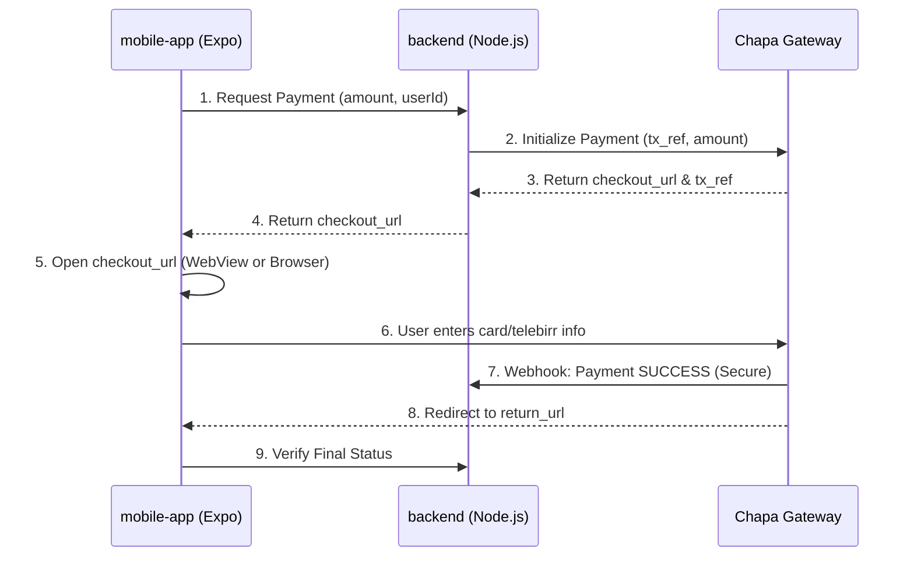

# Chapa Payment Integration for React Native

This guide explains how the Chapa payment system works for the ParkAddis mobile application and addresses your questions regarding URLs and browser behavior.

## 1. Data Flow

The payment process follows a 4-step "Handshake" between your App, your Backend, and Chapa.



---

## 2. Data Types

When you call `initializeChapaPayment` (via `/api/wallet/topup` or `/api/payment/create`), the data structures involved are:

### Initial Request (Mobile -> Backend)
- **Top-up:** `{ "amount": "100", "returnUrl": "parkaddis://payment-success" }`
- **Direct Charge:** `{ "qrToken": "xyz...", "returnUrl": "parkaddis://payment-success" }`

### Response (Backend -> Mobile)
Your backend returns the raw response from Chapa's initialization:
```json
{
  "status": "success",
  "message": "Hosted link",
  "data": {
    "checkout_url": "https://test.chapa.co/checkout/payment/XXXXXXXXXXXX"
  }
}
```

---

## 3. Handling Checkout & Return URLs

### "Do I need to change the return_url?"
**Short Answer:** Yes, if you want a perfect mobile experience.

Your current backend has a hardcoded `return_url` pointing to your Vercel website:
`return_url: "${process.env.VERCEL_URL}/payment/success?tx_ref=${tx_ref}"`

**What happens on mobile right now:**
1. Your app starts the payment.
2. It opens the Chapa checkout in the phone's browser.
3. Once finished, Chapa redirects to the **Vercel website** in that same browser.
4. **The user stays in the browser.** They have to manually close it and return to your app.

### Better Mobile Approach: Deep Linking
To make the browser automatically "jump" back to your app, you should use **Deep Links**.

1. **Step 1: Define a scheme in `app.json`**
   ```json
   {
     "expo": {
       "scheme": "parkaddis"
     }
   }
   ```
2. **Step 2: Backend automatically handles it**
   The backend logic has been updated to prioritize the `returnUrl` provided in the request body. If none is provided, it falls back to the Vercel website.

---

## 4. Implementation in React Native

There are two primary ways to show the payment screen:

### Option A: `WebBrowser` (Recommended for Expo)
This opens a mini-browser window *inside* your app (Safari View Controller / Chrome Custom Tabs).
```tsx
import * as WebBrowser from 'expo-web-browser';

const handlePayment = async () => {
  const { data } = await api.post('/wallet/topup', { amount: 100 });
  
  // This opens Chapa inside your app
  const result = await WebBrowser.openBrowserAsync(data.checkout_url);
  
  // When the user closes the window, check the status
  checkWalletBalance();
};
```

### Option B: `WebView` (More control)
Using `react-native-webview`, you can "watch" the URL. When the URL matches your `return_url`, you automatically close the modal.
```tsx
<WebView 
  source={{ uri: checkoutUrl }} 
  onNavigationStateChange={(navState) => {
    if (navState.url.includes('payment/success')) {
      // Close modal and refresh app state
      setModalVisible(false);
    }
  }} 
/>
```

## Summary Checklist
- [ ] **Data Flow:** App -> Backend -> Chapa -> User -> Webhook -> Redirect.
- [ ] **Return URL:** Hardcoded to Vercel? User stays in browser. Use deep links (`parkaddis://`) to return to app.
- [ ] **App Side:** Use `expo-web-browser` for a seamless native feel without manual redirect management.
